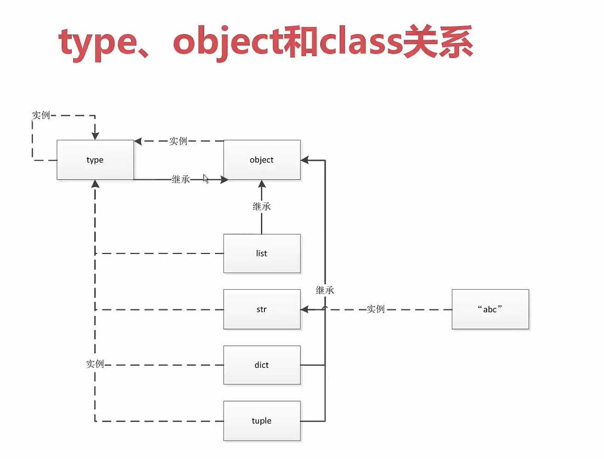

# 1. [一切皆对象](./code/01-object.py)
+ python 面向对象更加彻底
+ 可以动态修改类的属性
+ 函数和类都是对象，属于 python 的一等公民
    + 函数和类可以赋值给一个变量
    + 函数和类可以添加到集合对象中
    + 函数和类可以作为参数传递给函数
    + 函数和类可以当做函数的返回值
+ 对象三个特征: 身份，类型，值

# 2. [type, object](./code/02-type_object_class.py)
+ type 用来生成类(type 生成 int 类，int 生成 1)，所以类是由 type 类生成的对象
+ object 是最顶层的类，所有的类最顶部都是 object
+ object 是 type 的实例。type 本身也是自己的实例，同时 object 是所有类的父类。
+ type 是一个类，同时 type 也是一个对象，object 是由 type 生成的，但是 type 的基类是 object
+ object 是所有类都要继承的基类(基类是指 `Student.__bases__` )
    + `Student.__bases__` 指向的是 object，虽然我们没有写继承哪个类，但是如果不写的话，默认是继承 object 类
    + `FreshManStudent.__bases__` 指向的是 Student
+ 元类(metaclass) 是创建 **类** 的模板，也就是创建 **类** 对象的 **类**，称之为元类。
+ metaclass 实例化产生 class，class 实例化产生 instance
+ 所以，object 和 type 是两个源对象，互相依赖对方来定义。所以在 Python 中这个追溯终止在 type 类，即元类是 type 类或其子类，而 type类的元类就是它自己。
+ 由于 object 是 type 的实例，同时 list、tuple、dict 是 object 的子类，那么 list、tuple、dict 也是 type 的实例。
+ `lst = [1, 2, 3]` lst 是 list 的实例，同时 list 又是 object 的子类，所以 lst 也是 object 的实例



```python
a=1

print(type(1))
# <class 'int'>

print(type(int))
# <class 'type'>

class Student:
    pass
    
print(Student.__bases__)
# (<class 'object'>,)

class FreshManStudent(Student):
    pass

print(FreshManStudent.__bases__)
# (<class '__main__.Student'>,)

print(type(type))
# <class 'type'>

print(type.__bases__)
# (<class 'object'>,)

print(type(object))
# <class 'type'>

print(object.__bases__)
# ()
```

# 3. 内置类型
+ None 全局只有一个
+ 数值，int, float, complex(复数类型), bool
+ 迭代类型，可用 for 遍历
+ 序列类型，list, range, tuple, str, array, (bytes, bytearray, memoryview) 二进制序列
+ 映射，dict
+ 集合，set, frozenset
+ 上下文管理类型，with
+ 其他
    + 模块类型
    + class 和实例
    + 函数类型
    + 方法类型
    + 代码类型
    + object 对象
    + type 类型
    + ellipsis 类型
    + notimplemented 类对象

# 4. 变量类型及动态属性
## 4.1 变量类型
+ 数字
+ 字符串
+ 列表
+ 元组
+ 字典

## 4.2 数字
+ 数字类型
    + int
    + long
    + float
    + complex
+ 数学运算
    + `+` 加法
    + `-` 减法
    + `*` 乘法
    + `/` 除法
    + `%` 取模
    + `//` 取整除
    + `**` 幂

```python
print(type(100))    # <class 'int'>
print(type(1.12))   # <class 'float'>
print(type(3j + 1)) # <class 'complex'>
print(type(1.0/3))  # <class 'float'>
```
