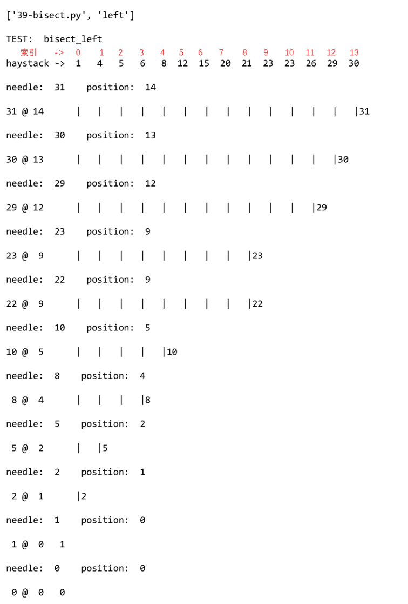
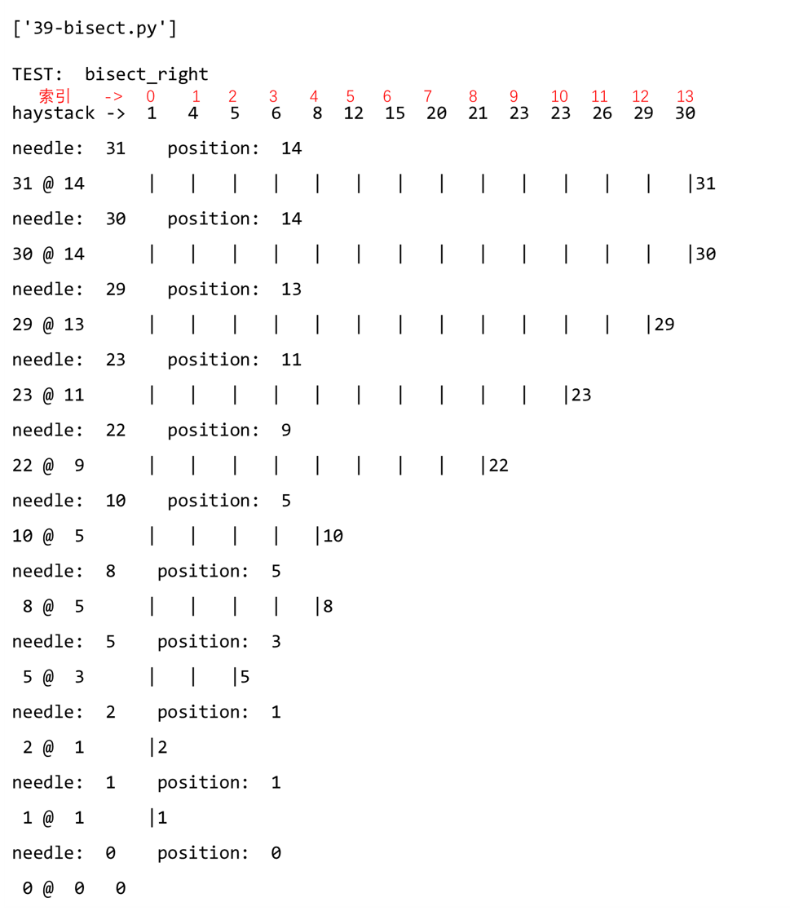

# 1. 内置序列类型

Python 标准库用 C 实现了丰富的序列类型

## 1.1 按照存放数据类型来分类

+ 容器类型，list，tuple，collections.deque，这些序列能存放不同类型数据
+ 扁平类型，str，bytes，bytearray，memoryview，array.array，这列序列只能容纳一种类型

容器序列存放的是它们所包含的任意类型的对象的引用，而扁平序列里存放的是值而不是引用。实际上就是说，扁平序列其实是一段连续的内存空间，所以扁平序列更加紧凑，但是它只能存放字符，字节和数值这种基础类型。

## 1.2 按照是否能被修改来分类
+ 可变序列，list，bytearray，array.array，collections.deque，memoryview
+ 不可变序列，tuple，str，bytes

# 2. 列表推导

列表推导是构建列表 list 的快捷方式，而生成器表达式则可以用来创建其他任何类型的序列。

很多 Python 程序员都把列表推导 list comprehension 简称为 listcomps，生成式表达器 generator expression 则成为 genexps。

使用列表推导的原则就是，只用列表推导来创建新的列表，并且尽量保持简短。如果列表推导的代码超过两行，那么就要考虑是否要用 for 循环重写

列表推导、生成器表达式，以及同它们很相似的集合 set 推导和字典 dict 推导，在 Python3 中都有了自己的局部作用域，就像函数一样。表达式内部的变量和赋值仅在局部起作用，表达式的上下文里的同名变量还可以被正常引用，局部变量并不会影响到它。

使用列表推导可以减少使用 filter 和 map 的使用

列表推导的作用只有一个，就是生成列表，如果想要生成其他类型的序列，就可以使用生成器表达式

```python
# 列表推导式
colors = ['black', 'white']
sizes = ['S', 'M', 'L']

tshirts = [(color, size) for color in colors for size in sizes]
print(tshirts)

# for 循环
for color in colors:
    for size in sizes:
        print(color, size)
```

# 3. 生成器表达式

列表推导可以用来初始化元组，数组或其他序列类型，但是生成器表达式是更好的选择。因为生成器表达式背后遵循了迭代器协议，可以逐个地产出元素，而不是先建立一个完整的列表，然后再把逐个列表传递到某个构造函数里，显然逐个产出元素更节省内存。

生成器表达式的使用，与列表生成式差不多，区别在于把中括号换成圆括号

```python
symbols = '$%#@!&*'
symbols_ord = tuple(ord(symbol) for symbol in symbols)
print(symbols_ord)

import array

array_i = array.array('I', (ord(symbol) for symbol in symbols))
print(array_i)
```

如果生成器表达式是一个函数调用过程中的唯一参数，那么不需要额外再用括号把它围起来

array 的构造方法需要两个参数，因此括号是必须的。array 构造方法的第一参数指定了数组中数字的存储方式

生成器表达式逐个产出元素，从来不会一次性产出所有的列表

# 4. 元组

元组的作用不仅仅是不可变列表，还可以用于没有字段名的记录

元组的每个元素都存放了记录中一个字段的数据，外加这个字段的位置，正是由于这个位置信息给数据赋予了意义。

元组拆包可以应用到任何可迭代对象上， 唯一的硬性要求是， 被可迭代对象中的元素数量必须要跟接受这些元素的元组的空档数一致，除非用 * 来表示忽略多余的元素。

最好辨认的元组拆包形式就是平行赋值，也就是说一个可迭代对象里的元素，一并赋值到对应的变量组成的元组中。

还可以使用 * 运算符把一个可迭代对象拆开作为函数的参数

```python
t = (20, 8)
print(divmod(*t))
```

如果拆包时有用不到的值，可以用 `_` 来作为占位符，但是如果做的是国际化软件，那么 `_` 可能就不是一个理想的占位符，因为它是 gettext.getttext 函数的常用别名。其他情况下，都可以用 `_`来做占位符

嵌套元组拆包

```python
metro_areas = [
    ('Tokyo', 'JP', 36.933, (35.689722, 139.691667)),
    ('Delhi NCR', 'IN', 21.935, (28.613889, 77.208889)),
    ('Mexico City', 'MX', 20.142, (19.43333, -99.133333)),
    ('New York-Newark', 'US', 20.104, (40.808611, -74.020386)),
    ('Sao Paulo', 'BR', 19.649, (-23.547778, -46.635833)),
]


print('{:15} | {:^9} | {:^9}'.format('', 'lat.', 'long.'))
fmt = '{:15} | {:9.4f} | {:9.4f}'
for name, cc, pop, (latitude, longitude) in metro_areas:
    if longitude <= 0:
        print(fmt.format(name, latitude, longitude))
```

具名元组 collections.namedtuple，这是一个工厂函数，可以用来构建一个带字段名的元组和一个有名字的类。用 namedtuple 构建的类的实例所消耗的内存跟元组是一样的，因为字段名都被存在对应的类里边。这个实例跟普通的对象实例比起来也要小一些，因为 Python 不会用 `__dict__` 来存放这些实例的属性

```python
import collections

Card = collections.namedtuple('Card', ['rank', 'suit'])
```

+ 作为不可变列表的元组，元组和列表之间，除了增减元素相关的方法之外，元组支持列表的其他所有方法。但是有一个列外，元组没有 `__reversed__` 方法，但是这个方法只是一个优化而已，reversed(my_tuple) 这个用法在没有 `__reversed__` 的情况也是合法的

# 5. 切片
多维切片和省略，`[]` 运算符里还可以使用逗号分开的多个索引或者是切片，外部库 Numpy 里就用到了这个特性，二维的 numpy.ndarray 就可以用 `a[i, j]` 这种形式来获取，或者是使用 `a[m:n, k:l]` 的方式来得到二维切片。

要正确处理这种 `[]` 运算符的话，对象的特殊方法 `__getitem__` 和 `__setitem__` 需要以元组的形式来接受 `a[i ,j]` 中的索引。也就是说，如果想要得到 `a[i, j]` 的值，Python 会调用 `a.__getitem__((i, j))`

Python 内置的序列类型都是一维的，因此他们只支持单一的索引，成对出现的索引是没有用的。

省略号 ellipsis 实际上是 Ellipsis 对象的别名，而 Ellisips 对象又是 ellipsis 类的单一实例。它可以当做切片规范的一部分，也可以用在函数的参数清单中，比如 `f(a, ..., z)` 或者 `a[i:...]`。在 Numpy 中，`...` 用作多维数组切片的快捷方式。如果 x 是四维数组，那么 `x[i, ...]` 就是 `x[i, :, :, :,]` 的缩写

切片赋值，可以通过切片操作修改序列的值。如果赋值的对象是一个切片，那么赋值语句的右侧必须是一个可迭代队形，即使是一个单一的值，也要转换为可迭代序列

```python
l = list(range(10))
l[2:5] = [20, 30]
print(l)
del l[5:7]
print(l)
```

注意，如果使用 `*` 初始化一个列表，那么需要注意，假如使用 `users = [[]] * 3`，那么得到的列表里的 3 个元素实际上是 3 个引用，而且这 3 个引用指向的是同一个列表。

```python
a = [['_'] * 3 for i in range(3)]
print(a)
a[0][1] = 'mark'
print(a)

b = [['_'] * 3] * 3
print(b)
b[1][2] = 0
print(b)
```

为了避免上边的问题，我们需要进行迭代操作

```python
a = []
for i in range (3):
    row=['_'] * 3
    a.append(row)
print(a)

a[0][0] = 0
print(a)
```

# 6. 序列增量赋值

序列增量赋值运算符 `+=` 和 `*=` 取决于他们的第一个操作对象，`+=` 背后的特殊方法是 `__iadd__` 用于就地加法，如果一个类没有实现这个方法，那么 Python 会退一步调用 `__add__`

```python
a = [1, 2, 3]
b = [4, 5, 6]
a = a + b
```

如果 a 实现了 `__iadd__` 方法，那么就会调用这个方法，同时对可变序列 list, bytearray 和 array.array 来说，a 会就地改动，就像是调用了 `a.extend(b)` 一样。

但是如果 a 没有实现 `__iadd__` 的话，那么 a += b 的效果就是 a = a + b。首先计算 a + b，得到一个新对象之后，然后赋值给 a。也就是说，在这个表达式里，变量名会不会被关联到新的对象里，取决于这个类型有没有实现 `__iadd__` 这个方法。可变序列一般都实现了 `__iadd__` 这个方法

```python
a = [1, 2, 3]
print(id(a))  # 2112905225352

a *= 2
print(a)     # [1, 2, 3, 1, 2, 3]
print(id(a)) # 2112905225352

t = (1, 2, 3)
print(id(t)) # 2112904596576
t *= 2
print(id(t)) # 2112904333640
print(t)     # (1, 2, 3, 1, 2, 3)
```

对于不可变序列进行重复拼接操作的话，效率会很低，因为每次都有一个新对象，而解释器需要把原来的对象复制到新的对象里，然后再追加新元素

但是 str 是一个列外，因为对字符串做 += 太普遍了，所以 CPython 对它做了优化。为 str 初始化内存的时候，程序会为他留出额外的可扩展空间，因为进行增量操作的时候，并不会涉及复制缘由字符串到新位置这类操作

关于 += 的谜题

```python
t = (1, 2, [30, 40])
t[2] += [50, 60]
print(t)
```

t 的结果是 `(1, 2, [30, 40, 50, 60])`，同时也抛出了一个错误，在 [Python Tutor](http://www.pythontutor.com/) 这个网站是一个 Python 运行原理可视化分析的工具。

**注意**

+ 不要把可变对象放在元组里。
+ 增量赋值不是一个原子操作
+ 查看 Python 的字节码不难，而且对我们了解代码背后的运行机制很有帮助

# 7. 排序

list.sort 方法会就地排序列表，返回值为 None。对应的内置函数是 sorted，sorted 会返回一个新的列表作为返回值，这个方法可以额接收任何形式的可迭代对象作为参数，包括不可变序列或生成器，但是不管参数是什么类型，返回的都是一个列表

list.sort 和 sorted 有两个参数，一个是 reverse，默认为 False，表示降序排列。另一个参数是 key，key 是一个只有一个函数的参数，这个函数作用于序列的每一元素，所产生的结果将是排序算法依赖的对比关键字。

# 8. bisect 管理已排序的序列

bisect 模块主要包含两个函数，bisect 和 insort，这两个函数都利用二分查找算法在有序序列中查找或插入元素

## 8.1 用 bisect 来搜索
bisect(haystack, needle) 在 haystack 干草垛里搜索 needle 针的位置，该位置满足的条件是，把 needle 插入这个位置之后，haystack 还能保持升序。也就是说，在这个函数返回的位置前面的值，都小于或等于 needle 的值。其中 haystack 必须是一个有序的序列。可以先用 bisect(haystack, needle) 查找位置 index，再用 haystack.insert(index, needle) 来插入新值，这样速度会更快一些。

bisect 有两个可选参数，lo 和 hi 来缩小查询范围。lo 的默认值为 0， hi 的默认值是序列的长度，即 len() 作用于该序列的返回值

bisect 是 bisect_right 的别名，还有一个函数叫 bisect_left，区别在于 bisect_left 返回的插入位置是原序列中跟被插入元素相等的元素的位置，也就是新元素会被放置于它相等的元素的前边。而 bisect_right 返回的则是跟它相等的元素之后的位置。这个差别对于一些值相等但是形式不同的数据类型来讲，结果会有不一样。

+ 示例代码

```python
# -*- encoding: utf-8 -*-

import bisect
import sys

HAYSTACK = [1, 4, 5, 6, 8, 12, 15, 20, 21, 23, 23, 26, 29, 30]
NEEDLES = [0, 1, 2, 5, 8, 10, 22, 23, 29, 30, 31]

ROW_FMT = '{0:2d} @ {1:2d}   {2}{0:<2d}'


def test(bisect_fn):
    for needle in reversed(NEEDLES):
        position = bisect_fn(HAYSTACK, needle)
        print('needle: ', needle, '   position: ', position)
        offset = position * "   |"
        print(ROW_FMT.format(needle, position, offset))


if __name__ == '__main__':
    print(sys.argv)
    if sys.argv[-1] == 'left':
        bisect_fn = bisect.bisect_left
    else:
        bisect_fn = bisect.bisect
    print('TEST: ', bisect_fn.__name__)
    print('haystack ->', '  '.join('%2d' % n for n in HAYSTACK))
    test(bisect_fn)
```

+ 使用 bisect_left

```
['39-bisect.py', 'left']
TEST:  bisect_left
haystack ->  1   4   5   6   8  12  15  20  21  23  23  26  29  30
31 @ 14      |   |   |   |   |   |   |   |   |   |   |   |   |   |31
30 @ 13      |   |   |   |   |   |   |   |   |   |   |   |   |30
29 @ 12      |   |   |   |   |   |   |   |   |   |   |   |29
23 @  9      |   |   |   |   |   |   |   |   |23
22 @  9      |   |   |   |   |   |   |   |   |22
10 @  5      |   |   |   |   |10
 8 @  4      |   |   |   |8
 5 @  2      |   |5
 2 @  1      |2
 1 @  0   1
 0 @  0   0
```



+ 使用 bisect_right

```
['39-bisect.py']
TEST:  bisect_right
haystack ->  1   4   5   6   8  12  15  20  21  23  23  26  29  30
31 @ 14      |   |   |   |   |   |   |   |   |   |   |   |   |   |31
30 @ 14      |   |   |   |   |   |   |   |   |   |   |   |   |   |30
29 @ 13      |   |   |   |   |   |   |   |   |   |   |   |   |29
23 @ 11      |   |   |   |   |   |   |   |   |   |   |23
22 @  9      |   |   |   |   |   |   |   |   |22
10 @  5      |   |   |   |   |10
 8 @  5      |   |   |   |   |8
 5 @  3      |   |   |5
 2 @  1      |2
 1 @  1      |1
 0 @  0   0
```



## 8.2 用 bisect.insert 插入新元素

使用 bisect.insert(req, item) 把变量 item 插入到序列 seq 中，并能保证 seq 的升序顺序

insort 和 bisect 一样，都有 lo 和 hi 两个可选参数用来控制查找的范围。

```python
import bisect
import random

SIZE = 7

random.seed(1729)

my_list = []

for i in range(SIZE):
    new_item = random.randrange(SIZE * 2)
    bisect.insort(my_list, new_item)
    print('%2d -> ' % new_item, my_list)
```

# 9. 其他序列

列表不能应对所有的场景，比如存放 1000 万个浮点数，数组的效率很高，因为数组的背后存放的不是 float 对象，而是逐字的机器翻译，也就是字节表述，跟 C 语言中的数组一样。如果要频繁对序列做先进先出操作， deque 双端队列的速度更快。如果要保证序列里元素的唯一性，使用 set 集合更合适，set 专为检查元素是否存在做过优化，但是它并不是序列，因为 set 是无序的。

# 9.1 数组

如果需要一个只包含数字的列表，那么 array.array 比 list 更高效。数组支持所有跟可变序列相关的操作，包括 .pop，.insert 和 .extend。

另外，数组还提供从文件读取和存入文件的更快的方法，比如 .frombytes 和 .tofile

Python 数组跟 C 语言数组一样精简，创建数组需要一个类型码，这个类型码用来表示在底层的 C 语言应该存放怎样的数据类型。比如 b 类型码代表的是有符号的字符 signed char，因此 array('b') 创建出的数组就只能存放一个字节大小的整数，范围是 -128 到 127，这样在序列很大的时候，我们能节省很多空间，而且 Python 不允许在数组里存放指定类型之外的数据。

```python
from array import array
from random import random

floats = array('d', (random() for i in range(10 ** 7)))

fp = open('floats.bin', 'wb')

floats.tofile(fp)

fp.close()

print(floats[-2])

floats2 = array('d')

fp = open('floats.bin', 'rb')

floats2.fromfile(fp, 10 ** 7)

fp.close()

print(floats2[-2])
```

array.tofile 和 array.fromfile 方法很简单，而且速度很快。用 array.fromfile 从一个二进制文件里读取 1000 万个双精度浮点数比从文本文件里读取的速度快很多，因为后者会使用内置的 float 方法把每一行文字转换成浮点数

使用 array.tofile 写到二进制文件，比以每行一个浮点数的方式把所有数字写入到文本文件快 7 倍。 1000 万个这样的数在二进制文件里只占用了 8000 万个字节，每一个浮点数占用 8 个字节，不需要任何额外的空间，如果是文本文件，那么需要 181515739 个字节

还有一个快速序列化数字类型的方法是使用 pickle 模块，pickle.dump 处理浮点数组的速度几乎跟 array.tofile 一样快。但是 pickle 可以处理几乎所有的内置数字类型，包含复数，嵌套集合，甚至是用户自定义的类。

## 9.2 内存视图 memoryview

memoryview 是一个内置类，它能让用户在不复制内容的情况下操作同一个数组的不同切片。 memoryview 受到 Numpy 的启发，Travis Oliphant 是 Numpy 的主要作者，他说

> 内存视图其实是泛化和去数学化的 Numpy 数组。他让你在不需要复制内容的前提下，在数据结构之间共享内存。其中数据结构可以是任何形式，比如 PIL 图片，SQLite 数据库和 Numpy 数组等，这个功能在处理大型数据集合的时候非常重要。

memoryview.cast 的概念跟数组模块类似，能用不同的方式读写同一块内存数据，而且内从字节不会随意移动。memoryview.cast 会把同一块内存里的内容打包成一个全新的 memoryview 对象。

```python
import array

numbers = array.array('h', [-2, -1, 0, 1, 2])

memv = memoryview(numbers)

print(len(memv))

print(memv[-2])

memv_oct = memv.cast('B')

print(memv_oct.tolist())

memv_oct[5] = 4
print(numbers)
```

## 9.3 双向队列和其他形式的队列

利用 .append 和 .pop 方法，可以把列表当做栈或者队列来用，就能模拟栈的先进先出特点，但是删除列表的第一个元素之类的操作是很耗时的，因为这些操作会牵扯到移动列表里的所有元素

collections.deque 类(双向队列) 是一个线程安全，可以快速从两端添加或者删除元素的数据类型。而且如果想要有一种数据类型来存放最近用到的几个元素，deque 是一个很好的选择，因为在新建一个双向队列的时候，你可以指定这个类的大小，如果这个队列满员，还可以从反向删除过期的元素，然后在尾端添加新的元素。

```python
from collections import deque

dq = deque(range(10), maxlen=10)
print(dq)

dq.rotate(3)
print(dq)

dq.rotate(-4)
print(dq)

dq.appendleft(-1)
print(dq)

dq.extend([11, 22])
print(dq)

dq.extendleft([10, 20, 30])
print(dq)
```

rotate 是旋转操作，当参数 n > 0 时，队列的最右边的 n 个元素会被移动到队列的左边。当 n < 0 时，最左边的 n 个元素会被移动到右边。

append 和 popleft 都是原子操作，就是说 deque 可以在多线程程序中安全地当做先进先出的栈使用，而使用者不需要担心资源锁的问题。

deque 提供了同步线程安全的类 Queue，LifoQueue 和 PriorityQueue，不同的线程可以利用这些数据类型来交换信息。这三个类的构造方法都有一个可选参数 maxsize，它接收正整数作为输入值，用来限定队列大小。但是在满员的时候，这些类不会让扔掉旧的元素来腾出位置，而是队列满了，它就会被锁住，知道另外的线程移除了某个元素而腾出了位置，这一特性让这些类很适合用来控制活跃线程的数量。

multiprocessing 这个包实现了自己的 Deque，跟 queue.Queue 类似，是设计给进程间通信用的，同时还有一个专门的 multiprocessing.JoinableQueue 类型，可以放任务管理变得更加方便

asyncio 是 Python 3.4 新提供的包，里面有 Queue，LifoQueue，PriorityQueue 和 JoinableQueue，这些类受到 queue 和 multiprocessing 模块的影响，但是为异步编程里的任务管理提供了专门的便利

heapq 没有队列类，而是提供了 heappush 和 heappop 方法， 可以把可变序列当成堆队列或者优先队列来使用
